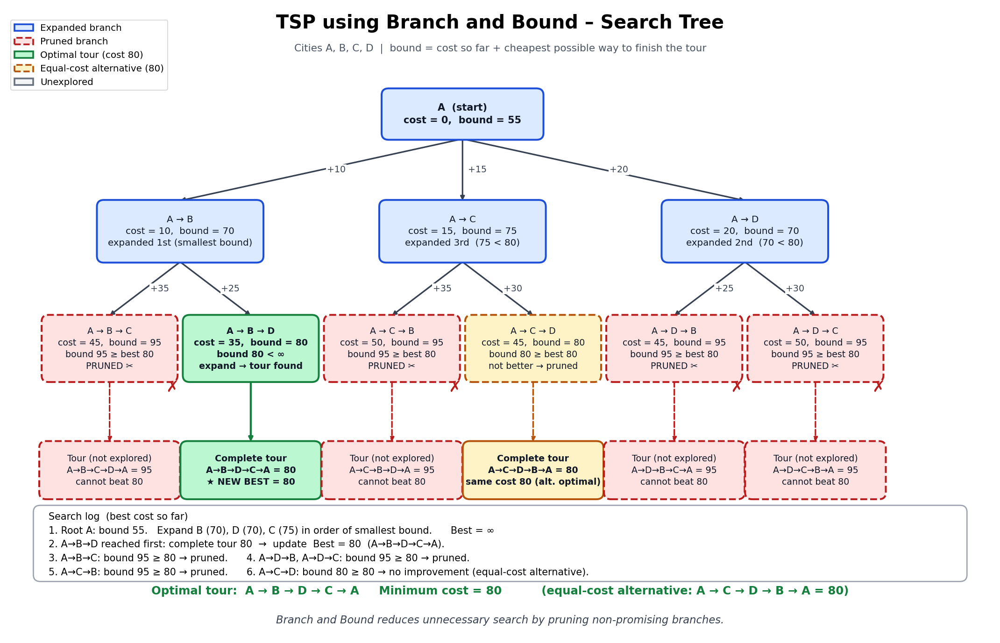

# Project 14 – TSP using Branch and Bound

## Description

This project implements the **Travelling Salesperson Problem (TSP)** using the **Branch and Bound** technique and visualizes the search tree through prompt engineering.

The objective of TSP is to find the minimum-cost tour that starts from a city, visits every city exactly once, and returns to the starting city.

In this project, 4 cities **A, B, C and D** are considered.

The cost matrix is:

```text
    A   B   C   D
A   0  10  15  20
B  10   0  35  25
C  15  35   0  30
D  20  25  30   0
```

---

## Algorithm

### Steps

1. Start from city A.
2. Generate branches for all possible unvisited cities.
3. Calculate the cost and bound for each branch.
4. Select a promising branch.
5. Continue exploring the selected branch.
6. If the bound is greater than or equal to the current best cost, prune the branch.
7. Continue until all useful branches are explored.
8. Return to the starting city after visiting all cities.
9. Compare the total costs.
10. Select the tour with the minimum cost.

### Pseudocode

```text
Algorithm TSP Branch and Bound

Start from city A

Calculate the initial bound

Create a node for city A

While there are nodes to explore:

    Select the node with the smallest bound

    If the bound is greater than or equal to
    the current best cost:

        Prune the branch

    Else if all cities are visited:

        Add the cost of returning to city A

        If total cost is less than best cost:

            Update best cost
            Update best path

    Else:

        For every unvisited city:

            Create a new branch

            Calculate its bound

            If bound is less than best cost:

                Continue exploring the branch

            Else:

                Prune the branch

Return the best path and minimum cost
```

---

## Example

Consider the following 4 cities:

```text
    A   B   C   D
A   0  10  15  20
B  10   0  35  25
C  15  35   0  30
D  20  25  30   0
```

Starting from city A, the possible tours are:

### Tour 1

```text
A → B → C → D → A
```

Cost:

```text
10 + 35 + 30 + 20 = 95
```

### Tour 2

```text
A → B → D → C → A
```

Cost:

```text
10 + 25 + 30 + 15 = 80
```

### Tour 3

```text
A → C → B → D → A
```

Cost:

```text
15 + 35 + 25 + 20 = 95
```

### Tour 4

```text
A → C → D → B → A
```

Cost:

```text
15 + 30 + 25 + 10 = 80
```

### Tour 5

```text
A → D → B → C → A
```

Cost:

```text
20 + 25 + 35 + 15 = 95
```

### Tour 6

```text
A → D → C → B → A
```

Cost:

```text
20 + 30 + 35 + 10 = 95
```

Therefore, the minimum cost is:

```text
80
```

The optimal tour is:

```text
A → B → D → C → A
```

The reverse tour:

```text
A → C → D → B → A
```

also has the same cost of **80**.

---

## Branch and Bound

Suppose the current best cost is:

```text
Best Cost = 80
```

If a branch has a bound greater than or equal to 80, that branch is **pruned** because it cannot produce a better solution.

This helps the algorithm avoid unnecessary searching.

---

## Prompt Used

```text
Draw a search tree showing bounding and pruning for TSP with 4 cities.
```

### Detailed Visualization Prompt

```text
Create a clean and simple academic visualization for a DAA college project titled:

"TSP using Branch and Bound – Search Tree"

Use 4 cities:

A, B, C and D

Use the following cost matrix:

    A   B   C   D
A   0  10  15  20
B  10   0  35  25
C  15  35   0  30
D  20  25  30   0

Show the Branch and Bound search tree starting from city A.

Show:
1. Starting city A.
2. Different possible branches.
3. Path costs.
4. Bounds for the branches.
5. Pruned branches.
6. Current best solution.
7. Optimal tour A → B → D → C → A.
8. Minimum cost 80.

Use arrows to show the search process.

Use a clean white background, readable fonts, simple colors,
and a professional academic style suitable for a DAA project.

Make sure all city names, costs and calculations are correct.
Do not add unnecessary decorative elements.
```

---

## Output

The visualization shows the Branch and Bound search tree for the 4-city TSP problem.

It represents:

- Starting city A
- Possible city selections
- Different branches
- Cost values
- Bounds
- Pruned branches
- Optimal solution

The final optimal tour is:

```text
A → B → D → C → A
```

Minimum cost:

```text
80
```

The generated visualization is saved as:

```text
Visualization.png
```



---

## Learning Outcome

- Understood the Travelling Salesperson Problem.
- Learned the Branch and Bound technique.
- Understood how bounds are used.
- Learned how unpromising branches are pruned.
- Understood how a search tree represents different TSP paths.
- Learned prompt-based visualization.
- Practiced GitHub documentation.